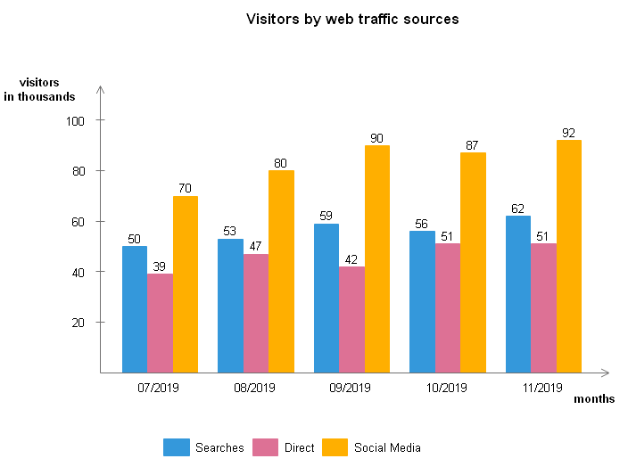

# DataScienceAss1

## Web Traffic Visualization

This project visualizes web traffic sources using Python's Matplotlib. It analyzes data from different traffic sources such as **Searches, Direct, and Social Media** over a period of five months.

## 📊 Visualization Overview
The bar chart represents visitors (in thousands) from three different sources:
- **Searches (Blue)**
- **Direct (Pink)**
- **Social Media (Orange)**

## 📂 Files in the Repository
- `web_traffic_chart.py` - Python script to generate the visualization.
- `column-chart-examples.jpg` - Sample output image.
- `README.md` - Documentation of the project.

## 🚀 How to Run the Code
1. **Clone the Repository**
   ```bash
   git clone https://github.com/Florida-Korir/DataScienceAss1.git
   cd DataScienceAss1
   ```
2. **Install Required Libraries**
   ```bash
   pip install matplotlib numpy
   ```
3. **Run the Python Script**
   ```bash
   python main.py
   ```
4. **View the Output**
   The visualization will be displayed as a bar chart.

## 📷 Sample Output


## 📌 Key Takeaways
- Social Media drives the highest traffic.
- Direct visits remain relatively stable.
- Search traffic fluctuates over time.

## 📬 Contact
For any queries, reach out via GitHub or LinkedIn!

---
**Author:** [Florida-Korir](https://github.com/Florida-Korir)
